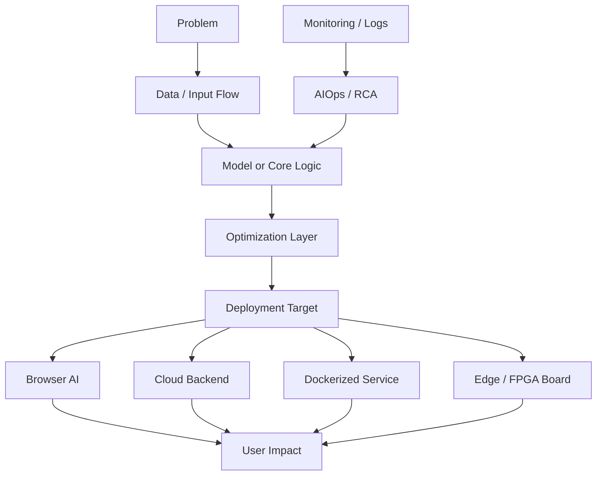
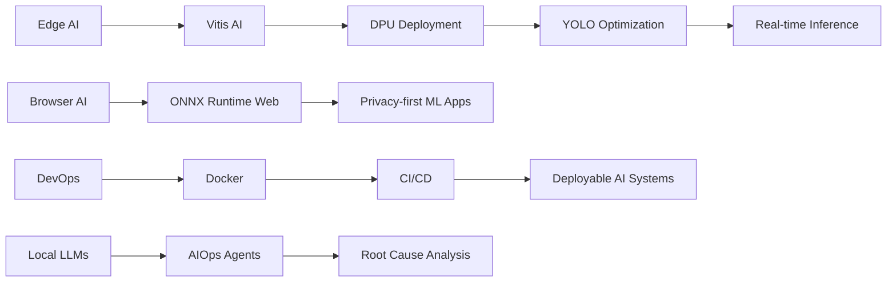

<!--
  Neon GitHub Profile README
  Profile: github.com/Partha-dev01
  Theme: Cyberpunk / Neon / Edge AI / DevOps
-->

<p align="center">
  
</p>

<p align="center">
  
</p>

<p align="center">
  <a href="https://github.com/Partha-dev01">
    
  </a>
  <a href="https://www.linkedin.com/in/P-G-7a3125324/">
    
  </a>
  
</p>

<p align="center">
  
  
  
  
</p>

---

##  About Me


I’m **Partha**, an **AI/ML and DevOps-focused IT engineering student** building practical systems across:

- **Edge AI and FPGA-accelerated inference**
- **YOLO model deployment on DPU boards**
- **Browser-side AI with ONNX Runtime Web**
- **Linux, Docker, GitLab CI/CD and homelab infrastructure**
- **Full-stack applications with React, Next.js, Node.js and SQL**
- **Cloud AI workflows using AWS Bedrock, Polly, DynamoDB and Amplify**

I enjoy working at the intersection of **hardware-aware AI**, **deployment engineering**, and **user-facing AI products**.

```yaml
name: Partha / PG
username: Partha-dev01
role: AI/ML & DevOps Engineer
education: B.Tech in Information Technology
primary_domains:
  - Edge AI
  - Computer Vision
  - DevOps
  - Full-Stack Engineering
  - Cloud AI
  - Linux Systems
current_focus:
  - YOLO inference optimization
  - Vitis AI and DPU deployment
  - Browser-side ONNX inference
  - Local LLM and AIOps experiments
  - Dockerized deployment pipelines
engineering_style:
  - Build practical systems
  - Keep deployments reproducible
  - Optimize for real-world constraints
  - Learn close to hardware and users
````

<br clear="right"/>

---

##  Engineering Identity

<table>
  <tr>
    <td width="50%">
      <h3>🧠 AI / ML</h3>
      <p>
        I work with vision models, local inference, ONNX deployment, quantization and model optimization.
      </p>
      <ul>
        <li>YOLOv8 / YOLOv11</li>
        <li>ONNX Runtime Web</li>
        <li>PyTorch</li>
        <li>Model quantization</li>
        <li>Browser-side inference</li>
      </ul>
    </td>
    <td width="50%">
      <h3>⚡ Edge AI</h3>
      <p>
        I’m interested in making models run efficiently on constrained hardware and FPGA/DPU platforms.
      </p>
      <ul>
        <li>Vitis AI</li>
        <li>DPU acceleration</li>
        <li>ZCU104</li>
        <li>Kria KR-260</li>
        <li>FPGA-board validation</li>
      </ul>
    </td>
  </tr>
  <tr>
    <td width="50%">
      <h3>⚙️ DevOps & Systems</h3>
      <p>
        I like building reliable environments where software can be tested, deployed and reproduced.
      </p>
      <ul>
        <li>Linux / RHEL</li>
        <li>Docker</li>
        <li>GitLab CI/CD</li>
        <li>Proxmox</li>
        <li>Bash automation</li>
      </ul>
    </td>
    <td width="50%">
      <h3>🌐 Full-Stack & Cloud</h3>
      <p>
        I build web platforms, dashboards, APIs and cloud-backed AI applications.
      </p>
      <ul>
        <li>React / Next.js</li>
        <li>TypeScript / JavaScript</li>
        <li>Node.js / Express</li>
        <li>SQL / DynamoDB</li>
        <li>AWS Bedrock, Polly, Amplify</li>
      </ul>
    </td>
  </tr>
</table>

---

## 🧬 Tech Constellation

<p align="center">
  
</p>

<p align="center">
  
  
  
  
  
</p>

---

## 🚀 Featured Build Grid

<table>
  <tr>
    <td width="50%">
      <h3>🧠 AutiSense</h3>
      <p>
        <b>AI-enabled early autism screening, diagnosis support and post-diagnosis care platform.</b>
      </p>
      <p>
        Built around privacy-first browser-side AI workflows, multimodal scoring, clinical report generation and cloud synchronization.
      </p>
      <p>
        <b>Stack:</b> Next.js, TypeScript, ONNX Runtime Web, AWS Bedrock, Polly, DynamoDB, Amplify
      </p>
      <p>
        <b>Highlights:</b>
      </p>
      <ul>
        <li>Browser-side ONNX inference</li>
        <li>Web Worker model execution</li>
        <li>Multimodal AI scoring flow</li>
        <li>AWS Bedrock generated reports</li>
        <li>Polly text-to-speech support</li>
        <li>DynamoDB sync and Amplify deployment</li>
      </ul>
      <a href="https://github.com/Partha-dev01/AutiSense">
        
      </a>
    </td>
    <td width="50%">
      <h3>⚡ YOLOv11 DPU Deployment</h3>
      <p>
        <b>FPGA/DPU-focused deployment work for optimized pedestrian detection.</b>
      </p>
      <p>
        Refactored YOLOv11-Nano to remove unsupported DPU operators, then quantized, compiled and deployed the model using Vitis AI.
      </p>
      <p>
        <b>Stack:</b> Vitis AI, PyTorch, ZCU104, PYNQ, DPU, Quantization
      </p>
      <p>
        <b>Highlights:</b>
      </p>
      <ul>
        <li>YOLOv11-Nano graph refactoring</li>
        <li>DPU compatibility optimization</li>
        <li>Quantization-aware deployment flow</li>
        <li>Vitis AI compilation</li>
        <li>ZCU104/PYNQ board validation</li>
      </ul>
      <p>
        
      </p>
    </td>
  </tr>
  <tr>
    <td width="50%">
      <h3>🛰️ Constitutional AIOps</h3>
      <p>
        <b>Local agent-based AIOps system for telemetry annotation and root-cause analysis.</b>
      </p>
      <p>
        Designed dual local Qwen agents with constitutional safety checks, graph memory and human approval workflows.
      </p>
      <p>
        <b>Stack:</b> Python, FastAPI, React, Neo4j, Docker
      </p>
      <p>
        <b>Highlights:</b>
      </p>
      <ul>
        <li>Local LLM agent design</li>
        <li>Telemetry annotation</li>
        <li>Root-cause analysis support</li>
        <li>Neo4j graph memory</li>
        <li>Human-in-the-loop approval</li>
        <li>Dockerized deployment</li>
      </ul>
      <p>
        
      </p>
    </td>
    <td width="50%">
      <h3>🌾 Farmer Market App</h3>
      <p>
        <b>Mobile app concept for farmer-wholesaler market interaction.</b>
      </p>
      <p>
        Focused on live bidding, market analytics and better price discussion workflows between farmers and wholesalers.
      </p>
      <p>
        <b>Stack:</b> React Native, Firebase
      </p>
      <p>
        <b>Highlights:</b>
      </p>
      <ul>
        <li>Live bidding concept</li>
        <li>Firebase-backed updates</li>
        <li>Market analytics flow</li>
        <li>Farmer-wholesaler communication</li>
        <li>Mobile-first interaction design</li>
      </ul>
      <p>
        
      </p>
    </td>
  </tr>
</table>

---

## 📌 Repository Cards

<p align="center">
  <a href="https://github.com/Partha-dev01/AutiSense">
    
  </a>
  <a href="https://github.com/Partha-dev01/WSL-installation-fix">
    
  </a>
</p>

<p align="center">
  <a href="https://github.com/Partha-dev01/image-api">
    
  </a>
  <a href="https://github.com/Partha-dev01/eventmanagement">
    
  </a>
</p>

---

## 🧪 Research Mode

```text
Research Intern — University of Calcutta, Technology Campus
Location: Kolkata, West Bengal
Mode: On-site
Period: Jan 2025 — Present

Core work:
> Set up Vitis AI runtime on Kria KR-260 and ZCU104
> Worked on DPU acceleration for AI inference
> Fine-tuned YOLOv8 for crowd detection and behavior analysis
> Performed model quantization, testing and validation
> Validated computer vision models on FPGA boards
```

<p align="center">
  
  
  
  
</p>

---

## 💼 Internship Timeline

<table>
  <tr>
    <td width="33%">
      <h3>🔬 Research Intern</h3>
      <p><b>University of Calcutta</b></p>
      <p>AI inference acceleration, Vitis AI, DPU, YOLOv8, FPGA board validation.</p>
    </td>
    <td width="33%">
      <h3>🌐 Full Stack Developer</h3>
      <p><b>Noesiser</b></p>
      <p>MERN development, REST APIs, SQL, Git and event platform workflows.</p>
    </td>
    <td width="33%">
      <h3>⚙️ Front-End / DevOps Intern</h3>
      <p><b>Nexisa</b></p>
      <p>Responsive UI components, Docker, CI/CD and deployment workflow support.</p>
    </td>
  </tr>
</table>

---

## 🧭 System Architecture Mindset



---

## ⚙️ DevOps & Infrastructure Notes

```bash
# Things I enjoy building and maintaining

linux_homelab="Proxmox + containers + reproducible services"
ci_cd="GitLab pipelines, Dockerized workflows, deployment automation"
systems="RHEL, Bash, networking basics, local environments"
cloud_ai="AWS Bedrock, Polly, DynamoDB, Amplify"
engineering_goal="Make projects easy to run, test, deploy and improve"
```

<p align="center">
  
  
  
  
</p>

---

## 🏆 Hackathon Signals

<p align="center">
  
  
  
</p>

```text
AI4Bharat AWS Hackathon
> Semi-finalist among selected teams
> Awarded AWS credits for project development

SIH 2023/24
> Selected with Rank #16 in the internal hackathon

Binary KGEC 2025
> Advanced to the final round from 1300+ participants
```

---

## 📜 Certification

<p align="center">
  
  
</p>

```text
Red Hat Certified System Administrator
Platform: RHEL 9.3
Focus: Linux administration, users, permissions, services, storage and system operations
```

---

## 📊 Neon GitHub Dashboard

<p align="center">
  
  
</p>

<p align="center">
  
</p>

<p align="center">
  
</p>

---

## 🏅 Trophy Rack

<p align="center">
  
</p>

---

## 🕹️ Current Questline



---

## 🔮 Current Focus Areas

<table>
  <tr>
    <td width="25%">
      <h3>01</h3>
      <p><b>Edge AI</b></p>
      <p>Running optimized AI models close to hardware and users.</p>
    </td>
    <td width="25%">
      <h3>02</h3>
      <p><b>Computer Vision</b></p>
      <p>YOLO-based detection, crowd analysis and deployment testing.</p>
    </td>
    <td width="25%">
      <h3>03</h3>
      <p><b>Cloud AI</b></p>
      <p>Using AWS AI services to build helpful user-facing workflows.</p>
    </td>
    <td width="25%">
      <h3>04</h3>
      <p><b>AIOps</b></p>
      <p>Exploring local agents for telemetry, logs and RCA support.</p>
    </td>
  </tr>
</table>

---

## 🧩 Problems I Like Solving

```text
> How do we make AI fast enough for edge hardware?
> How do we keep AI apps private and browser-first?
> How do we deploy full-stack systems without fragile manual steps?
> How do we combine local LLMs with real operational workflows?
> How do we turn research prototypes into usable systems?
```

---

## 🧠 Learning Loop

<p align="center">
  
  
  
  
</p>

```text
while learning:
    build something practical
    test it under constraints
    document what worked
    improve the deployment path
    repeat with a harder problem
```

---

## 🌍 Languages

<p align="center">
  
  
  
</p>

---

## 📫 Connect With Me

<p align="center">
  <a href="https://github.com/Partha-dev01">
    
  </a>
  <a href="https://www.linkedin.com/in/P-G-7a3125324/">
    
  </a>
</p>

<p align="center">
  <b>Building AI that runs closer to the user, closer to the hardware, and closer to real-world impact.</b>
</p>

---

<p align="center">
  
</p>
```
